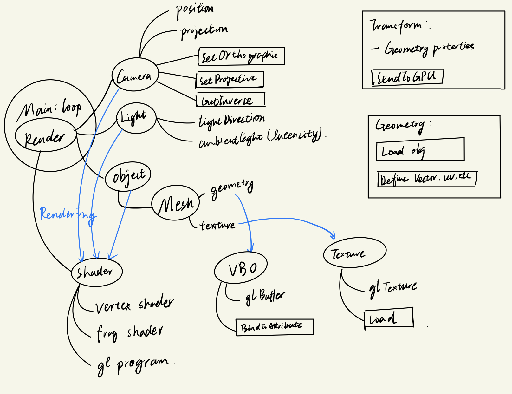
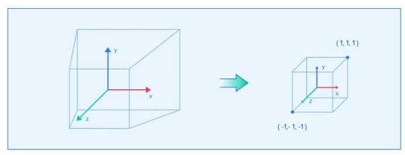

## Little WebGL Renderer

This is a WebGL renderer implemented following the tutorial: [3D Graphics: A WebGL Tutorial](https://www.toptal.com/javascript/3d-graphics-a-webgl-tutorial).
Here is the live [demo](https://unchained112.github.io/SmallWebGLExample/)

### Overview

The overall structure of the program is summarized in the following image.

### Notes

> The `Geometry` structure holds the exact data needed to send a model to the graphics card to process. Before you do that though, you’d probably want to have the ability to move the model around on the screen.

- The camera movement is done by moving the world by applying the inverse of the matrix as a transformation.

- The perspective project: The parameters `n` and `f` represent the `near` and `far` clipping planes, which are the smallest and largest distance a point can be to be captured by the camera.

- Note that the space in WebGL is a 3D space spanning between -1 and 1 on the x, y, and z axis. The z axis is supposed to contain the depth information when x and y will project onto the 2D canvas.

- The most important element for a WebGL application is the WebGL context. You can access it with `gl = canvas.getContext('webgl')`, or use `'experimental-webgl'` as a fallback, in case the currently used browser doesn’t support all WebGL features yet.

> The `canvas` we referred to is the DOM element of the canvas we want to draw on.

- The default **framebuffer** stores the color for each pixel of the canvas that the WebGL context is bound to. Each pixel is located between -1 and 1 on x and y axis. 

- WebGL by default does not use the z axis.  To use it, enable it by `gl.enable(gl.DEPTH_TEST)`. Enabling the depth test allows a pixel to store both color and depth. Enabling the depth test allows a pixel to store both color and depth. You can only draw the pixel color with z smaller than the original one (closer to the camera). Otherwise, the draw attempt will be ignored.

- Any draws you perform stay on the screen until you tell them to get cleared. To do so, you have to call `gl.clear(gl.COLOR_BUFFER_BIT | gl.DEPTH_BUFFER_BIT)`.

### WebGL Graphics Pipeline

1. After receiving the vertex data in the form of 3D space vector, we want to move those data into the GPU memory by creating a new **Vertex Buffer Object (VBO)**. A **Buffer Object** in general is an object that stores an array of memory chunks on the GPU.

    > You can see three calls to the `gl` context. The `createBuffer()` call creates the buffer. The `bindBuffer()` call tells the WebGL state machine to use this specific memory as the current VBO (`ARRAY_BUFFER`) for all future operations, until told otherwise. After that, we set the value of the current VBO to the provided data, with `bufferData()`.

    - Variables stored on the GPU are **not garbage collected**. That means that we have to manually delete them once we don’t want to use them any more.

2. After that, we need a two-step process of moving points into desired positions and painting all individual pixels. The first part is a **Vertex Shader**, which is run for each vertex, and outputs where we should place the vertex on the screen, among other things. The second part is the **Fragment Shader**, which is run for each pixel that a triangle covers on the screen, and outputs the color that pixel should be painted to. WebGL shaders are written in GLSL. 

    Vertex shader variables:
    - `attribute` — These are inputs that hold specific properties of a vertex. Previously, we described the position of a vertex as an attribute, in the form of a three-element vector. You can look at attributes as values that describe one vertex.   
    - `uniform` — These are inputs that are the same for every vertex within the same rendering call. You can use a `uniform` variable to describe a transformation matrix. You can point to resources such as texture on the GPU. 
    - `varying` — These are outputs that we pass to the fragment shader. You can look at varyings as values that describe surfaces between vertices.
    
    Fragment shader differences:
    - There are no more `varying` outputs, and `attribute` inputs have been replaced with `varying` inputs. 
    - The output now is `gl_FragColor`, which is a `vec4`. The elements represent red, green, blue, and alpha (RGBA), respectively, with variables in the 0 to 1 range.
    - At the beginning of the fragment shader, you need to set the float precision, which is important for interpolations. 

3. Finally, we draw the model. Here we start with sending all the camera related uniforms to the GPU. Then we take the transformations and VBOs and assign them to uniforms and attributes, respectively. Since this has to be done to each VBO, you can create its data binding as a method. Then we assign an array of three floats to the uniform. In the end, we draw something on the screen.